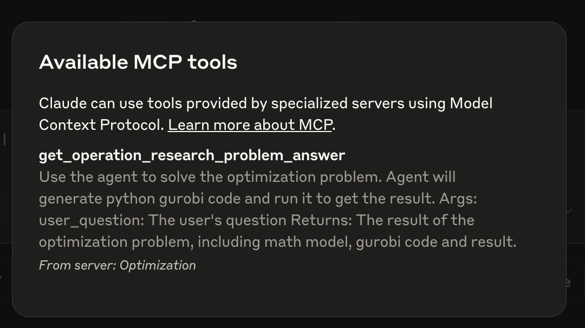

<div align="center">
<h1 align="center">
OR-LLM-Agent: 基于推理大型语言模型的运筹优化问题建模与求解自动化框架
</h1>

[英文版本 English Version](./README.md)

<p align="center"> 
<a href="https://arxiv.org/abs/2503.10009" target="_blank"></a>
<a href="https://github.com/bwz96sco/or_llm_agent"></a>  
<a href="https://youtu.be/O_0jd940nGk?si=c3JBRga1pJfI21wL" target="_blank">

</a>
<a href="https://huggingface.co/datasets/SJTU/BWOR" target="_blank">

</a>
</p>


</div>

<br>

## 设置 MCP 服务端与客户端

<div align="center">

</div>

我们为该工具新增了 **模型上下文协议（MCP）服务端**，以便于使用。根据 Claude MCP 官网的官方文档，我们推荐使用 `uv` 包管理器来搭建 MCP 服务端。

```bash
# 创建虚拟环境并激活
uv venv
source .venv/bin/activate

# 安装依赖
uv add -r requirements.txt
```

在 MCP 客户端中使用时，这里以 Claude 桌面客户端为例，首先需要在 `claude_desktop_config.json` 文件中添加 MCP 路径：

```python
{
    "mcpServers": {
        "Optimization": {
            "command": "/{UV 安装目录的绝对路径}/uv",
            "args": [
                "--directory",
                "/{OR-LLM-AGENT 项目的绝对路径}",
                "run",
                "mcp_server.py.py"
            ]
        }
    }
}
```

然后即可打开 Claude 桌面客户端，检查锤子图标中是否出现 `get_operation_research_problem_answer`。



<br><br>

---
<p align="center">
由上海交通大学与南洋理工大学联合完成
</p>
