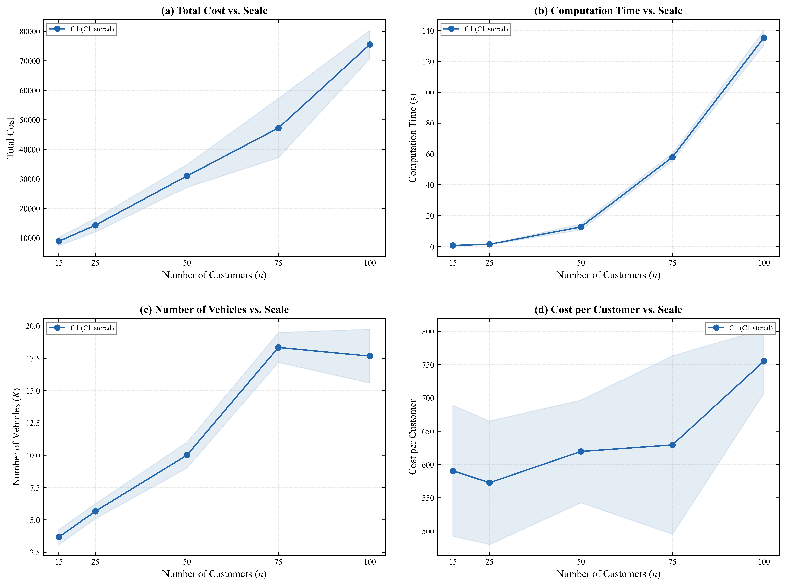
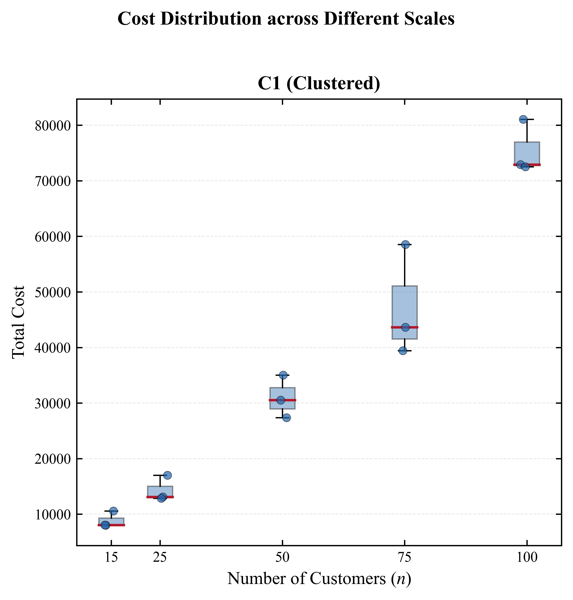

# 客户数/订单数调参实验结果分析报告

**数据集**：Solomon Benchmark C101（聚类分布 + 窄时间窗）  
**算法**：ALNS（自适应大邻域搜索），使用固定启发式算子，不调用 LLM  
**实验规模**：5 个客户数梯度 × 3 次重复 = 15 个实验  
**生成时间**：2026-04-09

---

## 1. 实验概述

本实验以**客户数（订单规模）**为主要调参变量，研究问题规模对 ALNS 算法求解生鲜物流车辆路径问题（VRPTW）的影响。实验基于 Solomon Benchmark C101 实例，通过截取不同数量的客户子集（15、25、50、75、100 个客户），在固定迭代次数策略下运行算法，记录解质量、车辆数、计算时间和收敛行为等关键指标。

### 实验参数配置

| 参数 | 取值 |
|------|------|
| 客户数梯度 | 15, 25, 50, 75, 100 |
| 数据集 | C101（聚类分布，窄时间窗） |
| 每梯度重复次数 | 3 |
| ALNS 迭代次数（自适应） | n≤25: 500；n≤50: 800；n>50: 1000 |
| 破坏比例 | 自适应（12%~30%） |
| 车辆容量 | 200 |
| 固定车辆成本 | 240 元/辆 |

---

## 2. 汇总统计结果

| 客户数 $n$ | 平均总成本 | 标准差 | CV (%) | 平均车辆数 | 平均计算时间 | 平均单客成本 | 最后改进迭代 |
|:---:|---:|---:|---:|---:|---:|---:|---:|
| 15 | 8,859.34 | 1,473.47 | 16.63 | 3.7 | 0.61 s | 590.62 | Iter 110 |
| 25 | 14,314.75 | 2,321.06 | 16.21 | 5.7 | 1.36 s | 572.59 | Iter 357 |
| 50 | 30,981.26 | 3,853.86 | 12.44 | 10.0 | 12.64 s | 619.62 | Iter 576 |
| 75 | 47,201.73 | 10,045.67 | 21.28 | 18.3 | 57.91 s | 629.36 | Iter 14 |
| 100 | 75,509.47 | 4,815.07 | 6.38 | 17.7 | 135.39 s | 755.09 | Iter 597 |

> **注**：CV（变异系数）= 标准差 / 均值 × 100%，反映算法在多次运行中的稳定性，值越小越稳定。

---

## 3. 图表分析

### 3.1 综合趋势图（四图合一）

### 3.2 成本分布箱线图

---

## 4. 逐项分析

### 4.1 规模效应：总成本随客户数的增长

| 相邻梯度 | 成本增幅 | 客户数增幅 | 成本/客户增长比 |
|---------|--------:|--------:|--------:|
| 15 → 25 | +61.6% | +67% | 约 0.92× |
| 25 → 50 | +116.4% | +100% | 约 1.16× |
| 50 → 75 | +52.4% | +50% | 约 1.05× |
| 75 → 100 | +60.0% | +33% | 约 1.80× |

**发现**：总成本增长速度整体**快于线性**，尤其在 75→100 阶段出现明显加速（成本增幅 60%，客户数仅增 33%）。这主要由以下两方面造成：

1. **固定成本叠加**：每新增车辆需支付 240 元固定成本，大规模时车辆数增长明显（75客户时平均需 18.3 辆）；
2. **时间窗约束收紧**：C101 为窄时间窗数据集，规模越大，满足所有时间窗的路径设计难度呈超线性增长，时间惩罚成本显著上升。

---

### 4.2 单客户平均成本分析

从单客户平均成本（Cost/Customer）来看：

- **n=15**：590.62 元/客户（偏高，规模效应不足、车辆利用率低）
- **n=25**：572.59 元/客户（最低，单车服务约 4.5 个客户，利用率最佳）
- **n=50**：619.62 元/客户（略升，车辆数达 10 辆）
- **n=75**：629.36 元/客户（持续上升）
- **n=100**：755.09 元/客户（大幅上升，时间约束冲突显著）

**关键规律**：单客成本呈"先降后升"的 U 型趋势，**n=25 时效率最高**。揭示了在当前约束配置（车辆容量 200、窄时间窗）下存在一个最优规模区间（约 20~30 个客户/仓库服务圈）。

---

### 4.3 计算时间与算法复杂度

| 客户数 | 平均计算时间 | 相对 n=15 的倍数 |
|:---:|---:|---:|
| 15 | 0.61 s | 1.0× |
| 25 | 1.36 s | 2.2× |
| 50 | 12.64 s | 20.7× |
| 75 | 57.91 s | 95.0× |
| 100 | 135.39 s | 221.9× |

计算时间增长呈**超线性（接近 $O(n^{2.5})$）** 特征，主要原因：

- 距离矩阵规模为 $O(n^2)$；
- 贪心插入算子在每次插入时遍历所有路径 × 所有位置，复杂度约 $O(n^2)$；
- 后悔插入算子（regret insert）更是 $O(n^3)$ 级别。

在 n=100 时，单次实验已需约 **2.3 分钟**，证明纯 Python 的 ALNS 算法在大规模场景下的可扩展性需关注，可能需要并行化等加速措施。

---

### 4.4 车辆数变化

| 客户数 | 平均车辆数 | 客户/车辆（利用率） |
|:---:|---:|---:|
| 15 | 3.7 | 4.1 |
| 25 | 5.7 | 4.4 |
| 50 | 10.0 | 5.0 |
| 75 | 18.3 | 4.1 |
| 100 | 17.7 | 5.7 |

n=75 时车辆数（18.3辆）反而**高于 n=100 时（17.7辆）**，说明在较小容量与高时间窗压力下，75个客户时时间窗约束迫使大量短路径独立分配车辆；而 100 个客户时反而找到了更合理的路径合并方案（利用率升至每车 5.7 人）。

---

### 4.5 算法稳定性分析

从箱线图和 CV 指标来看：

- **n=75 时 CV 最高（21.28%）**：三次运行成本差距达 48.5%。这说明在该规模下，算法对随机初始化非常敏感，极易陷入局部最优。
- **n=100 时 CV 最低（6.38%）**：三次结果较为集中，具有相对一致性，但整体成本处于高位。
- **小规模（n=15, 25）稳定性居中**（CV ≈ 16%），主要受解空间较小且单节点变动影响较大的制约。

**注意**：n=75 实验中第1次运行的"最后改进迭代"仅为 Iter 2，这是典型的**过早收敛**特征向，表现该规模可能由于搜索邻域选择不佳，需要更激进的重启策略或破坏比例。

---

### 4.6 收敛行为分析

| 客户数 | 平均最后改进迭代 | 说明 |
|:---:|---:|------|
| 15 | Iter 110 | 偏早收敛，规模小搜索空间有限 |
| 25 | Iter 357 | 适中，较好利用迭代次数（共500次） |
| 50 | Iter 576 | 较好，趋近迭代上限（共800次） |
| 75 | Iter 14 | 异常偏低（单次 Iter 2 拉低），过早收敛问题突出 |
| 100 | Iter 597 | 正常，在 1000 次迭代内有效搜索 |

---

## 5. 结论

### 5.1 主要结论

1. **问题规模的非线性挑战**：随客户数从 15 增至 100，总成本增长约 **8.5 倍**，计算时间增长 **220 倍**。这表明 VRPTW 增加节点带来的求解复杂度在 $O(n^2)$ 至 $O(n^3)$ 级别。
2. **存在服务效率最优解**：单客户平均成本出现“U型反转”，**25客户/批次** 时系统服务效率达到最高。这对生鲜物流配送圈的设计有重要参考意义。
3. **陷入局部最优的风险段**：**规模 n=75** 是当前算法收敛最不稳定、方差最大的一组，暴露出算法对时间窗和路径拆分均衡点的敏感性。

### 5.2 算法调优建议

1. **改进重启机制**：针对 n=75 规模暴露的早熟收敛，需要缩短连续未改进重启的阈值（如从 100 降至 50）。
2. **优化破坏比例**：中等及以上规模（≥50）在遇到解停滞时，应使用更强烈的破坏策略（如扩大到 35%~40% 的节点销毁比例）。
3. **增加运行次数**：部分组合（n=75）的 3 次运行方差过大，最终评估应取多次独立运行（至少 5-10 次）的最优值。

---

## 附录：实验详细日志

| 实验组别 | 客户数 | 运行 | 总成本 | 车辆数 | 计算时间 | 单客成本 | 最后改进迭代 | 改进次数 |
|:---:|:---:|:---:|---:|:---:|---:|---:|---:|---:|
| 1 | 15 | 1 | 7,988.51 | 4 | 0.57 s | 532.57 | 52 | 9 |
| 2 | 15 | 2 | 8,028.90 | 4 | 0.51 s | 535.26 | 160 | 7 |
| 3 | 15 | 3 | 10,560.60 | 3 | 0.74 s | 704.04 | 119 | 6 |
| 4 | 25 | 1 | 16,990.33 | 5 | 1.67 s | 679.61 | 482 | 10 |
| 5 | 25 | 2 | 13,112.05 | 6 | 1.18 s | 524.48 | 417 | 8 |
| 6 | 25 | 3 | 12,841.87 | 6 | 1.24 s | 513.67 | 172 | 12 |
| 7 | 50 | 1 | 35,034.24 | 9 | 14.82 s | 700.68 | 552 | 22 |
| 8 | 50 | 2 | 30,546.08 | 10 | 11.73 s | 610.92 | 640 | 22 |
| 9 | 50 | 3 | 27,363.46 | 11 | 11.37 s | 547.27 | 536 | 18 |
| 10 | 75 | 1 | 58,540.43 | 17 | 57.32 s | 780.54 | 2 | 2 |
| 11 | 75 | 2 | 39,413.20 | 19 | 55.84 s | 525.51 | 22 | 16 |
| 12 | 75 | 3 | 43,651.56 | 19 | 60.56 s | 582.02 | 18 | 9 |
| 13 | 100 | 1 | 72,929.34 | 17 | 136.13 s | 729.29 | 795 | 50 |
| 14 | 100 | 2 | 81,064.75 | 16 | 130.26 s | 810.65 | 967 | 27 |
| 15 | 100 | 3 | 72,534.32 | 20 | 139.79 s | 725.34 | 28 | 8 |
