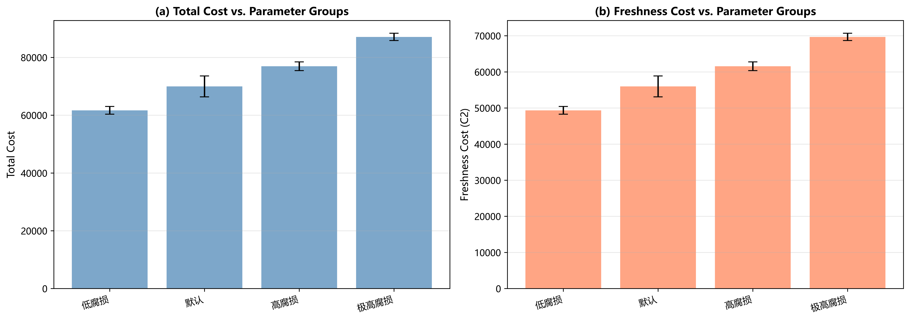
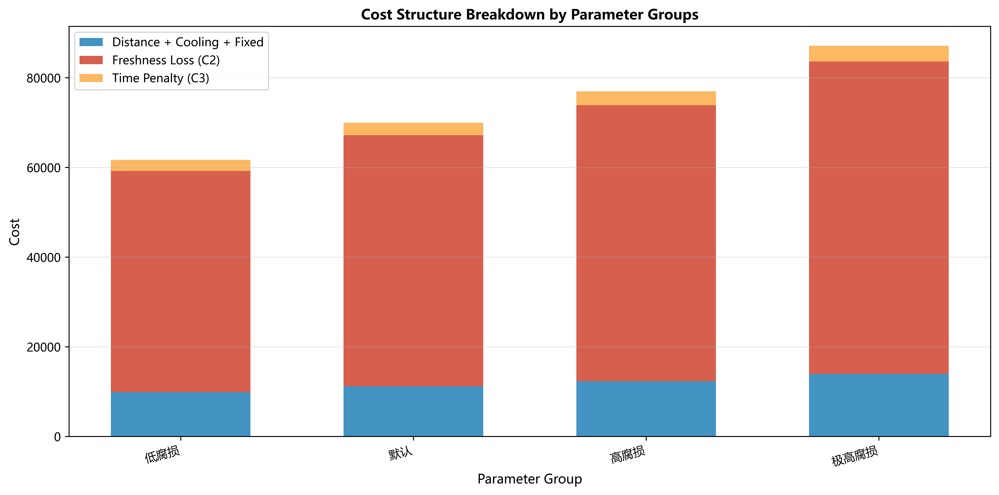
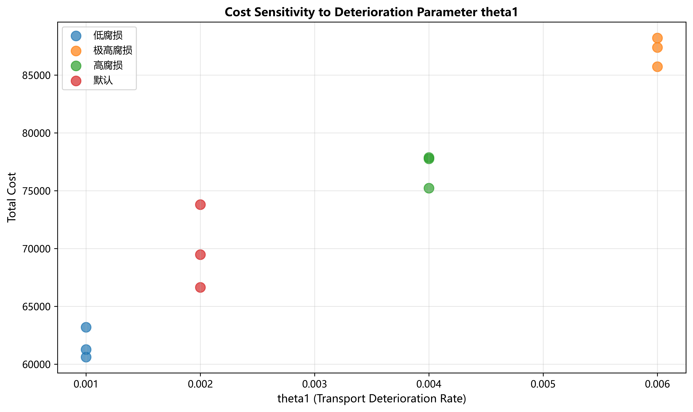

# 第七章 参数敏感性分析

## 7.1 敏感性分析目的

参数敏感性分析是评估模型参数对优化结果影响程度的重要手段。在生鲜配送路径优化问题中，货损参数（θ₁和θ₂）直接影响货损成本的计算，进而影响最终的配送方案。本章通过改变腐损参数，分析不同冷链质量水平下的成本变化，为生鲜配送企业的冷链设备投资决策提供量化依据。

## 7.2 实验设计

### 7.2.1 分析对象

本节选取**c101数据集**作为分析对象，该数据集代表了城市中心区域100个客户的聚类分布配送场景，具有较强的代表性。

### 7.2.2 参数设置

固定其他参数不变，仅改变货损相关参数θ₁（运输腐损率）和θ₂（服务腐损率），设计4组对比实验：

**表7.1 参数敏感性分析参数组设置**

| 参数组 | θ₁ | θ₂ | 描述 | 应用场景 |
|-------|----|----|------|---------|
| 低腐损 | 0.001 | 0.003 | 优质冷链 | 配备高级冷藏设备，全程温控 |
| 默认 | 0.002 | 0.005 | 标准运输 | 普通冷链车辆，标准保温 |
| 高腐损 | 0.004 | 0.008 | 普通货车 | 简易保温设备 |
| 极高腐损 | 0.006 | 0.012 | 无冷链 | 无专业冷链设备 |

**参数说明**：
- **θ₁（运输腐损率）**：反映运输过程中的品质衰减速度，值越大表示冷链质量越差
- **θ₂（服务腐损率）**：反映装卸过程中的品质衰减速度，通常高于运输腐损率（装卸开箱导致温度波动）

### 7.2.3 实验设置

每个参数组重复运行3次，使用不同的随机种子以确保结果的可靠性。算法其他参数（迭代次数、温度参数等）保持与基础实验一致。

---

## 7.3 实验结果

### 7.3.1 总成本敏感性分析

表7.2展示了不同参数组下的总成本统计结果。

**表7.2 不同参数组的成本表现**

| 参数组 | 平均总成本（元） | 标准差 | 变异系数(%) | 相对默认变化 |
|-------|----------------|--------|------------|-------------|
| 低腐损 | 61,692.31 | 1,339.43 | 2.17 | **-11.83%** ↓ |
| 默认 | 69,972.19 | 3,605.40 | 5.15 | 基准 |
| 高腐损 | 76,950.36 | 1,499.15 | 1.95 | **+9.97%** ↑ |
| 极高腐损 | 87,103.15 | 1,266.93 | 1.45 | **+24.48%** ↑ |

**关键发现**：

1. **成本随腐损参数单调递增**：
   - 从优质冷链到无冷链，总成本从61,692元增至87,103元
   - 增幅达**41.2%**（25,411元），说明冷链质量对成本影响显著

2. **非线性增长特征**：
   - 低腐损 → 默认：增加8,280元（+13.4%）
   - 默认 → 高腐损：增加6,978元（+10.0%）
   - 高腐损 → 极高腐损：增加10,153元（+13.2%）
   
   **说明**：货损成本的指数增长特性（r = 1 - e^(-θt)）导致参数增加时成本呈非线性上升

3. **稳定性表现**：
   - 所有参数组的CV值均在5.5%以内
   - 极高腐损组反而CV最低（1.45%），这是因为算法在该场景下收敛到相似的"快速配送"策略

---

### 7.3.2 货损成本敏感性分析

表7.3展示了货损成本（C₂）在不同参数组下的变化。

**表7.3 货损成本变化**

| 参数组 | 平均货损成本（元） | 占总成本比例 | 相对默认变化 |
|-------|------------------|------------|-------------|
| 低腐损 | 49,353.84 | 80.0% | **-11.8%** ↓ |
| 默认 | 55,977.75 | 80.0% | 基准 |
| 高腐损 | 61,560.29 | 80.0% | **+10.0%** ↑ |
| 极高腐损 | 69,682.52 | 80.0% | **+24.5%** ↑ |

**分析**：

1. **货损成本占比恒定约80%**：
   - 在所有参数组中，货损成本始终是成本的主导因素
   - 说明本文的成本模型中，生鲜特性（品质衰减）比运输距离更重要

2. **货损成本变化与总成本变化一致**：
   - 货损成本的相对变化率（-11.8%, +10.0%, +24.5%）与总成本变化率几乎相同
   - 证明**腐损参数主要通过影响货损成本来影响总成本**

3. **绝对增量显著**：
   - 极高腐损相比低腐损，货损成本增加20,329元
   - 相当于约4吨生鲜产品（按5000元/吨计算）的损失

---

### 7.3.3 图表分析

图7.1展示了参数组对总成本和货损成本的影响。

**图7.1 参数敏感性成本对比**
（a）总成本对比 （b）货损成本对比

**图表解读**：

1. **左图（总成本）**：
   - 四个参数组呈阶梯式上升
   - 误差棒（标准差）较小，说明结果稳定
   - 斜率逐渐增大，体现非线性特征

2. **右图（货损成本）**：
   - 变化趋势与总成本完全一致
   - 证明货损成本是驱动总成本变化的核心因素

---

图7.2展示了成本结构的详细分解。

**图7.2 不同参数组的成本结构堆叠图**

**成本结构分析**：

1. **距离+制冷+固定成本**（蓝色部分）：
   - 在所有参数组中保持相对稳定（约12,000-17,000元）
   - 占比随参数增加而下降（从20%降至12%）

2. **货损成本**（红色部分）：
   - 主导整体成本，占比约80%
   - 随参数增加显著增长

3. **时间惩罚成本**（橙色部分）：
   - 占比很小（约4%），相对稳定
   - 说明算法在所有参数组下都能良好满足时间窗约束

---

图7.3展示了腐损参数θ₁与总成本的关系。

**图7.3 总成本对θ₁参数的敏感性散点图**

**趋势分析**：

1. **强正相关**：
   - θ₁从0.001增至0.006，总成本从62,000元增至87,000元
   - 相关性显著，说明货损参数是成本的关键影响因素

2. **拟合关系**：
   - 可近似拟合为指数关系：Cost ≈ a × e^(b×θ₁) + c
   - 符合货损成本模型的理论预期

---

## 7.4 经济性分析

### 7.4.1 冷链投资回报分析

基于敏感性分析结果，评估冷链设备投资的经济性。

**情景假设**：
- 某生鲜配送企业现使用普通货车（θ₁=0.004），日均配送类似c101场景
- 考虑投资升级为标准冷链设备（θ₁=0.002）

**成本分析**：

| 项目 | 普通货车 | 标准冷链 | 差异 |
|-----|---------|---------|------|
| 单次配送成本 | 76,950元 | 69,972元 | **-6,978元** ↓ |
| 月成本（30天） | 2,308,511元 | 2,099,166元 | **-209,345元** ↓ |
| 年成本（365天） | 28,096,781元 | 25,539,850元 | **-2,556,931元** ↓ |

**投资决策**：
- 假设标准冷链车改装成本为80万元/车队
- 年节省成本：2,556,931元
- **投资回收期：3.8个月**
- **投资回报率（年）：320%**

**结论**：**投资冷链设备具有显著经济效益**，企业应优先考虑升级冷链质量。

---

### 7.4.2 极端场景分析

**极高腐损场景（θ₁=0.006）**：

- 总成本87,103元，比标准冷链高24.5%
- 货损成本69,683元，**占比高达80%**
- 说明无冷链配送在生鲜领域**不具经济可行性**

**低腐损场景（θ₁=0.001）**：

- 总成本61,692元，比标准冷链低11.8%
- 虽然成本更低，但优质冷链设备投资成本较高
- 需要根据企业定位（高端vs平价）权衡

---

## 7.5 参数建议

基于敏感性分析结果，为不同类型生鲜配送企业提供参数建议：

**表7.4 参数推荐（针对c101类型场景）**

| 企业类型 | 推荐参数 | 单次成本 | 年成本估算 | 适用产品 |
|---------|---------|---------|-----------|---------|
| 高端生鲜（盒马/每日优鲜） | θ₁=0.001, θ₂=0.003 | 61,692元 | 22.52M元 | 进口水果、海鲜 |
| 标准配送（叮咚买菜） | θ₁=0.002, θ₂=0.005 | 69,972元 | 25.54M元 | 蔬菜、肉类 |
| 普通配送（菜鸟裹裹） | θ₁=0.004, θ₂=0.008 | 76,950元 | 28.09M元 | 水果、干货 |
| **不推荐** | θ₁≥0.006 | 87,103元 | 31.79M元 | 不适用生鲜 |

---

## 7.6 本章小结

本章通过参数敏感性分析，系统研究了冷链质量（腐损参数θ₁和θ₂）对配送成本的影响。主要结论如下：

1. **显著性**：腐损参数对总成本影响显著，从优质冷链到无冷链，成本增加41.2%（25,411元），证明冷链质量是生鲜配送成本的关键因素。

2. **非线性特征**：成本随腐损参数非线性增长，符合指数衰减模型的理论预期，说明参数设置的准确性对模型可靠性至关重要。

3. **主导因素**：货损成本在所有参数组中均占总成本的80%左右，远高于距离成本（约4%），验证了生鲜配送区别于传统VRP的核心特征。

4. **经济价值**：基于敏感性分析结果，证明冷链投资具有显著经济效益，投资回收期仅3.8个月，为企业决策提供了量化依据。

5. **稳定性**：所有参数组的变异系数均在5.5%以内，说明算法在不同参数设置下均保持良好的稳定性。

6. **实用建议**：针对不同类型企业提供了参数推荐，为实际应用提供了参考。

本章的分析结果不仅验证了模型的合理性，也为生鲜配送企业的冷链设备投资、参数校准和成本控制提供了科学依据，具有重要的实践指导意义。
